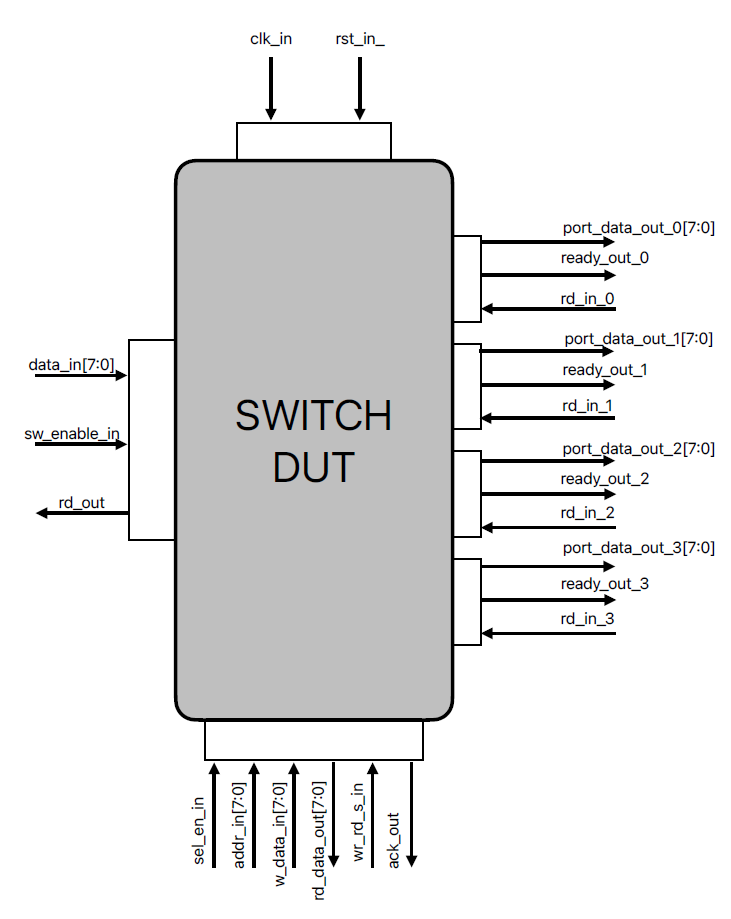
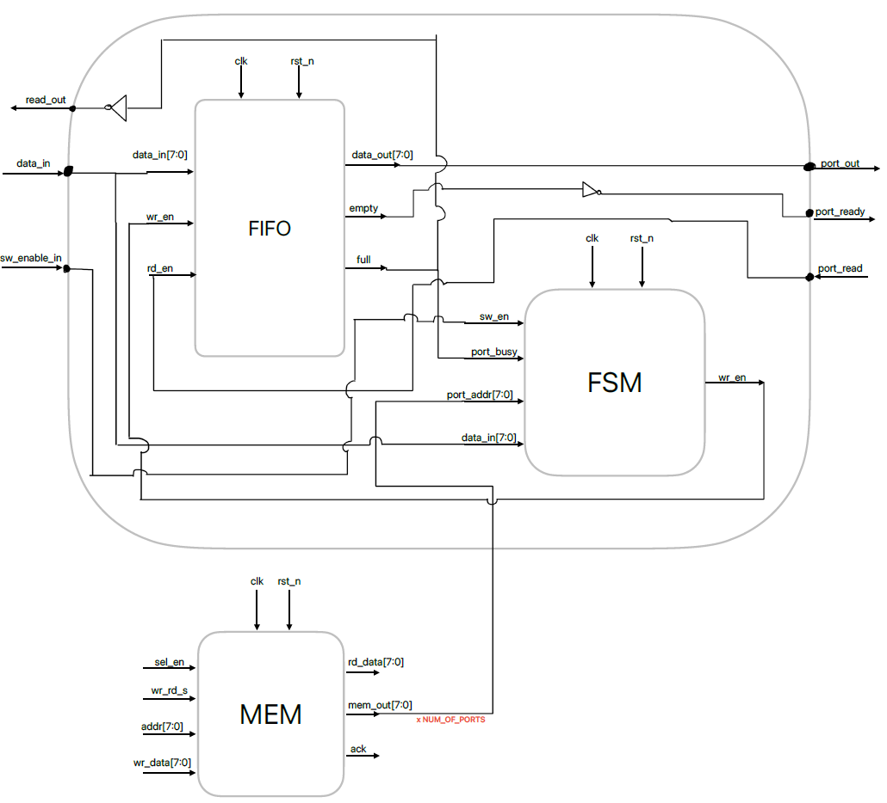

# cluster-lvl-switch-uvm-tb
 
Welcome to the Simple Cluster Switch DUT TB!

**
    To be completed with cluster information
**

## Unit level description

The Switch design is capable of driving incoming packets to 4 different ports.

- The packet enters trough the input interface byte after byte and is stored in one of the internal FIFOs corresponding to each port.
- Each port has an address configurable trough the memory interface. 
- For the packet to arrive to a specific port, the DESTINATION ADDRESS(DA) should be the same as the port address.

A packets has the following frame (the frame is valid for both input and output of the SWITCH):

> =================================================================
> Destination Address | Source Address | Data Length | Payload Data
>         8 b         |      8 b       |     8 b     |   0-255 B 
> =================================================================

### Input Interface

- the packet enters trough the data_in[7:0] bus, byte after byte
- each byte is valid onlyif the sw_enable_in is set on high
- rd_out is a signal designed for enabeling the read from previous switch ports.
- rd_out is high while the FIFO's are not FULL

### Output Interface

- the port first sets the ready output, signaling that data is ready for read
- next clock cycle should the read signal arrive
- in the clock cycle after the read signal arrives, the data is driven on port_data_out_x[7:0] bus byte after byte, while the read and ready signals are set.

### Memory Interface

- a write transaction happens when in same clock cycle, the sel_en is set, the address and data is available and the wr_rd_s_in strobe is high
- ack_out for a write transaction is provided next clock cycle

- a read transaction happens when in same clock cycle, the sel_en is set, the address is available and the wr_rd_s_in strobe is low.
- the data read will be visible next clock cycle on rd_data_out, togheter with the corresponding ack_out

